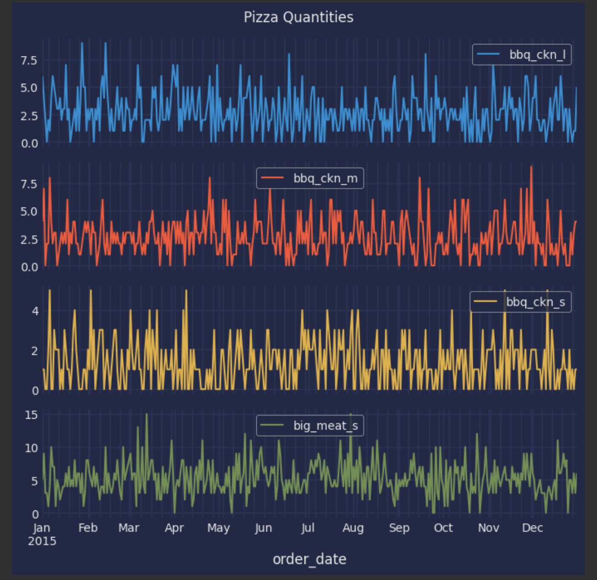

# Dominoe's - Predictive Purchase Order System 
# A Multiple Time Series Demand Forecasting Project

## Skills Takeaway From This Project
- Data Cleaning and Preprocessing
- Exploratory Data Analysis (EDA)
- Multiple Time Series Forecasting
- Predictive Modeling
- Business Decision Making
- Real-world Application of Data Science

---

## Domain
**Food Service Industry**

---

## Problem Statement
Dominoe's Pizza aims to optimize its inventory management by predicting future pizza sales and automating purchase orders for ingredients. This predictive system helps ensure sufficient ingredient stock without overstocking, reducing waste and avoiding stockouts. The project uses historical sales data and ingredient requirements to build a forecasting model that enhances inventory management and operational efficiency.

---

## Business Use Cases
1. **Inventory Management**: Maintain optimal stock levels for ingredients to meet demand without overstocking.
2. **Cost Reduction**: Minimize waste and reduce costs from excess or expired inventory.
3. **Sales Forecasting**: Predict sales trends to inform promotions and strategies.
4. **Supply Chain Optimization**: Streamline the ingredient ordering process to align with forecasted sales.

---

## Dataset
- **Dataset Link**:
  - [Sales Data](https://github.com/pramodkondur/Dominoes-TimeseriesForecasting/blob/master/data/Pizza_Sale.xlsx)
  - Also at [kaggle](https://www.kaggle.com/datasets/nextmillionaire/pizza-sales-dataset)
  - [Ingredients Data](https://github.com/pramodkondur/Dominoes-TimeseriesForecasting/blob/master/data/Pizza_ingredients.xlsx)

### Data Explanation
1. **Sales Data**: Historical sales records including date, pizza type, quantity sold, price, category, and ingredients.
2. **Ingredient Data**: Ingredient requirements for each pizza type, specifying the amount needed per pizza (pizza type, ingredient, quantity needed).
3. **Dated**: Data from 01-01-2015 to 31-12-2015
4. **Unique Values:** Contains 91 unique pizzas and 64 unique pizza ingredients
   

---

## Approach
### 1. Data Preprocessing and Exploration
- **Data Cleaning**: Handled missing data, outliers, and format inconsistencies.
- **Exploratory Data Analysis (EDA)**: Analyzed historical trends, seasonality, and patterns in sales data, and visualize to identify important features.

   Data of only 4 unique pizzas for visualization

    

### 2. Further Data Preparation and Model Selection:
- **Feature Engineering**: Extracted features such as day of the week, month, promotions, and holiday effects.
- **Model Selection**: Selected time series forecasting models like Linear Regression, Decesion Trees, Random Forest, Gradient boost models, and LSTM(Long Short-Term Memory RNN).

### 3. Model Training Using Classic ML models:
- **Data Conversion**: Categorical data was one-hot encoded and label encoded before feeding to the machine learning models
- **Train-Test Split**: Since this is a time series data, we don't randomly split but we split by time as to not lead to data leakage
- **Model Evaluation**: Evaluation of the classic ml models using metrics such as **Mean Absolute Error (MAE)**, **Root Mean Squared Error (RMSE)**, and **Mean Squared Error(MSE)** to ensure accuracy
- **Although Gradient Boosting gives us the best among them and a good MAE, it's not ideal**
  
  

### 4. Model Training Using LSTM model:
- **Data Conversion**: Data converted into multiple time series format for the 91 unqiue pizzas
- **Why LSTM?**: Classic machine learning models give us single output and if we want multiple we need to run them multiple times and in our case a forecast of 7 days for 91 pizzas would amount to running the machine learning model 637 times. Thus we can use LSTM RNN as it can take in multiple inputs and produce multiple outputs and is well versed in dealing with time data


[image link](https://www.semanticscholar.org/paper/Multi-output-RNN-LSTM-for-multiple-speaker-speech-Pascual-Bonafonte/19fb693353cca4a172cbd64f599e4bb06572b52e)
- **Train-Test Split**: Since this is a time series data, we don't randomly split but we split by time as to not lead to data leakage
- **Model Evaluation**: Evaluation of the classic ml models using metrics such as **Mean Absolute Error (MAE)**, **Root Mean Squared Error (RMSE)**, and **Mean Squared Error(MSE)** to ensure accuracy
- **Model Hypertuning**: Model was hypertuned and have achieved a best **MAE** **0.96** using LSTM
- **Outputs of LSTM**: Outputs got from LSTM as below as then rounded off to the closest integer and appended to the pizza_names_id column headers from our transformed multiple time series dataframe
  
  


### 5. Purchase Order Generation:
- **Sales Forecasting**: Using the trained LSTM model, prediction of pizza demand for the next week (or chosen period) was done.
- **Ingredient Calculation**: Calculated the required ingredient quantities in grams based on forecasted sales and the pizza ingridents table.
- **Purchase Order Creation**: Generated a purchase order that details the quantities of each unique pizza in each day and the unique ingredients quantity in grams needed for each day in the forecast.

### 6. Interactive Web Application:
- **Real Time Selection of Forecast Duration**: An interactive web application was created using StreamLit where the user is able to choose the forecast period in real time.
- **Reports visualisation**: Reports are generated in on the streamlit application itself for quick insights.
- **Excel Reports**: Forecast reports are also downloaded offline in excel format for easy access.
  
### 7. Demo Output:


---


## Link to the notebook file
You can view the code and in depth analysis in the full notebooks

Part1: [here](./notebooks/mainnotebook1.ipynb)

Part2: [here](./notebooks/mainnotebook2.ipynb)


## Conclusion Summary

In this project, a comprehensive approach was taken to enhance Dominoe's pizza order forecasting capabilities:

### Data Cleaning and Preparation
The data was meticulously cleaned and preprocessed to ensure accuracy and consistency. This involved:
- Handling missing values
- Standardizing data formats
- Consolidating relevant information

### Model Development
A Long Short-Term Memory (LSTM) network was developed to predict the quantities of 91 unique pizza orders and their associated ingredients over the next 7 days. This advanced machine learning model was chosen for its effectiveness in time series forecasting.

### Model Evaluation
The LSTM model was evaluated using Mean Absolute Error (MAE), achieving a value of **0.96**. This reflects the model's high accuracy and reliability in making forecasts.

### Results and Output
Forecasts for the next 7 days were generated(or any number chosen by user can be selected), detailing predictions for each pizza order and ingredient quantities in grams. These predictions were saved to Excel files for convenient review and offline access.

### Further Steps
As there was only one year of data, more data can be appended as time progresses to learn yearly seasonalities and trend and also as more data arrives, the model can be further trained with goal of improving accuracy even further.

### Applications and Benefits
Accurate forecasting of pizza orders and ingredient quantities provides significant benefits, including:
- Improved inventory management
- Optimized supply chain logistics
- Enhanced operational efficiency

Further by anticipating demand more accurately, Domino's can:
- Reduce waste
- Ensure timely ingredient availability
- Boost overall customer satisfaction

In summary, this project showcases a successful application of predictive analytics in the pizza industry, demonstrating the ability to drive actionable insights and operational improvements through advanced machine learning techniques.

---

## Technical Tags
- Data Cleaning
- EDA
- Demand Forecasting
- Multiple Time Series Forecasting
- LSTM/Regression Models
- Predictive Modeling
- Inventory Management
- Python
- Pandas
- Scikit-learn
- Matplotlib/Seaborn
- Streamlit Application

---

## Project Structure
1. **`data/`**: Contains the cleaned sales and ingredient datasets.
2. **`models/`**: Pre-trained LSTM/Regression models.
3. **`notebooks/`**: Jupyter notebooks for EDA, model building, and evaluation.
4. **`streamlit_app/`**: Code for the Streamlit application used for real-time forecasting and purchase order generation.
5. **`output/`**: Contains forecasted sales and purchase orders saved as Excel files.

---

## How to Run the Project

1. **Clone the Repository:**
   ```bash
   git clone https://github.com/pramodkondur/Dominoes-TimeseriesForecasting.git

2. **Navigate to the Project Directory:**
    ```bash
   cd Dominoes-TimeseriesForecasting

3. **Install Dependencies:**
  Ensure you have Python 3.7 or higher installed. Then, install the required Python packages using:
    ```bash
    pip install -r requirements.txt
    
4. **Run the Streamlit Application:**
  Start the Streamlit app with the following command:
    ```bash
    streamlit run streamlit_app/streamlitapp.py

This command will launch the Streamlit server and open the app in your default web browser. You can interact with the app to forecast pizza orders and view ingredient requirements.
